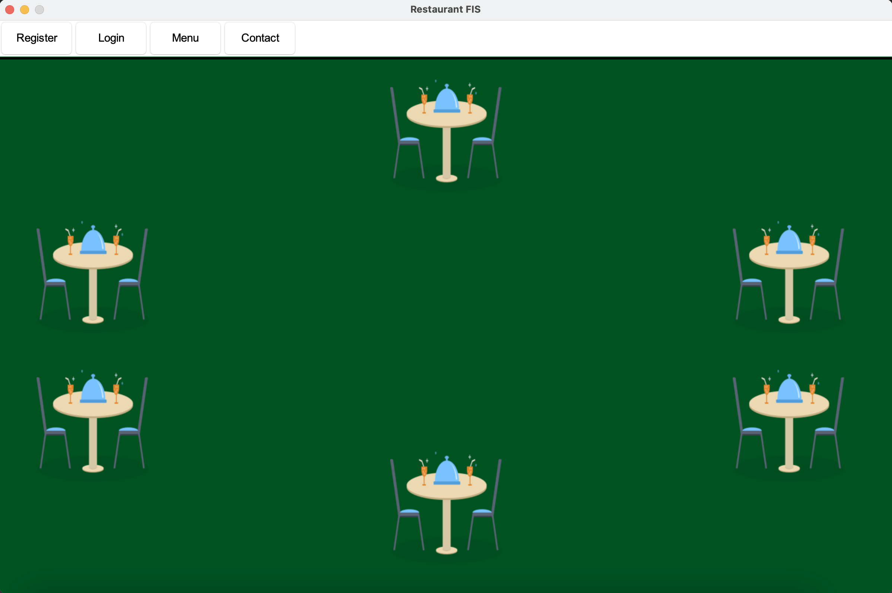
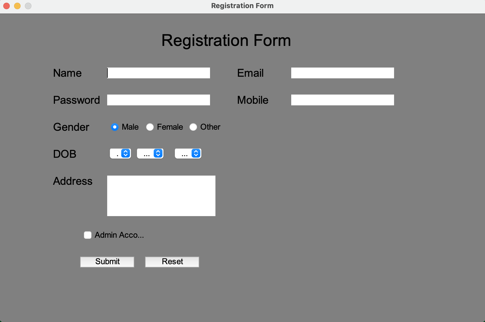
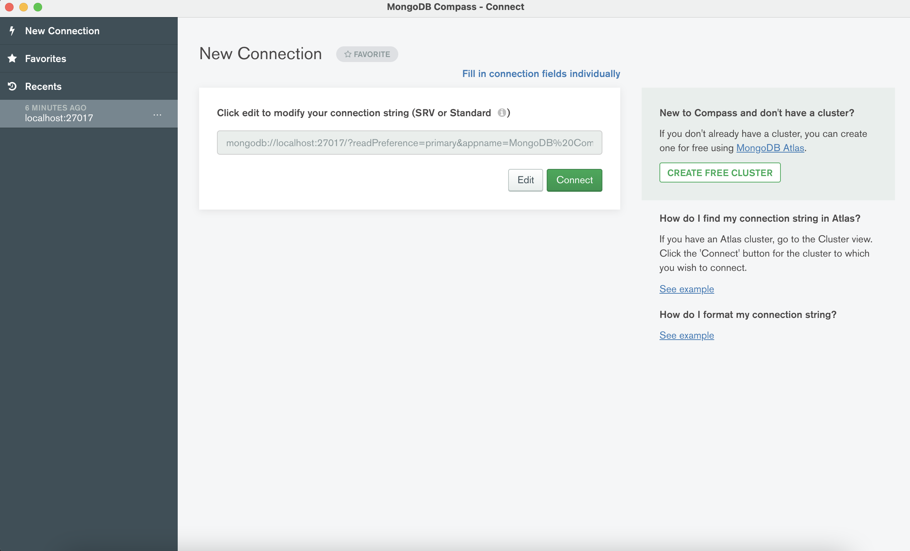
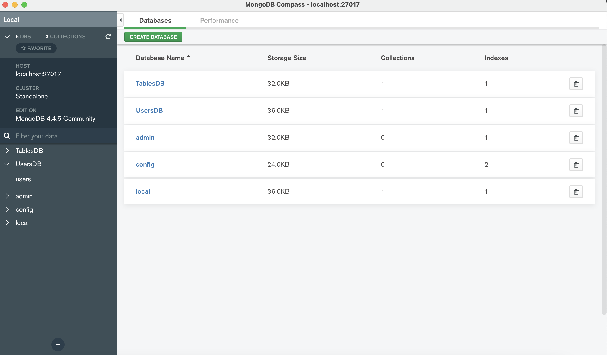
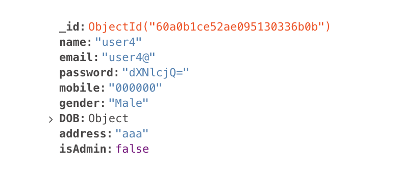

# Restaurant-Fis
This is a Java-Swing application that aims both clients and the staff of a restaurant, having many useful features. The clients, on the one hand, can make online reservations, see the menu or the contact info of the restaurant. On the other hand, the staff can edit the menu, see the info of the clients or see the reservation .

The app was developed using the following technologies:

* [Java 15 or 16](https://www.oracle.com/java/technologies/javase-downloads.html)
* [Java Swing](https://docs.oracle.com/javase/tutorial/uiswing/start/index.html) (as GUI)
* [Maven](https://maven.apache.org/) (as build tools)
* [MongoDB](https://www.mongodb.com/1) (as Database)

## Prerequisites
To be able to install and run this project, please make sure you have installed Java 11 or higher. Otherwise, the setup will note work!
To check your java version, please run `java -version` in the command line.

To install a newer version of Java, you can go to [Oracle](https://www.oracle.com/java/technologies/javase-downloads.html) or [OpenJDK](https://jdk.java.net/).

It would be good if you also installed Maven to your system. To check if you have Maven installed run `mvn -version`.

If you need to install it, please refer to this [Maven tutorial](https://www.baeldung.com/install-maven-on-windows-linux-mac).

Make sure you install JavaFX SDK on your machine, using the instructions provided in the [Official Documentation](https://openjfx.io/openjfx-docs/#install-javafx). Make sure to export the `PATH_TO_FX` environment variable, or to replace it in every command you will find in this documentation from now on, with the `path/to/javafx-sdk-15.0.1/lib`.

_Note: you can download version 15 of the javafx-sdk, by replacing in the download link for version 16 the `16` with `15`._

## Setup & Run
To set up and run the project locally on your machine, please follow the next steps.

### Clone the repository
Clone the repository using:
```git
git clone https://github.com/fis2021/Restaurant-Fis
```

### Verify that the project Builds locally
Open a command line session and `cd Fit-Connect`.
If you have installed all the prerequisites, you should be able to run any of the following commands:
```
mvn clean install
```


### Open in IntelliJ IDEA
To open the project in IntelliJ IDEA, you have to import it as a Maven project.
After you import it, in order to be able to run it, you need to set up your IDE according to the [official documentation](https://openjfx.io/openjfx-docs/). Please read the section for `Non-Modular Projects from IDE`.
If you managed to follow all the steps from the tutorial, you should also be able to start the application by pressing the run key to the left of the Main class.

### Run the project with Maven

To start and run the project use the following command:
* `mvn clean install`  and then press on the .jar file


You should see an application starting, that looks like :



Push the register button and register as an user(client/admin(admin password : 123)) filling the registration template which appeared after pushing the registration button




However, if you try to register a user with the same username again, you will see an error message


### What happened???

Behind the scenes, the app actually saved the user in the database, encrypting the password. To see that it actually worked we need to introduce the connection string(mongodb: //localhost:27017):



And go to the users database:



You should be able to see that there is a single database entry with the username you just added. Also, please notice that the password is saved encrypted!




#### Encrypting Passwords
Encrypting the passwords is done via the following 2 Java functions, found in [UserService.java](https://github.com/fis2021/Fit-Connect/blob/main/src/main/java/org/loose/fis/sre/services/UserService.java):
```java
    public static String encodePassword(String password){

        String encodedPassword = Base64.getEncoder().encodeToString(password.getBytes());
        return encodedPassword;
        }
```

#### MongoDB
MongoDB was used in the [UserService.java](https://github.com/fis2021/Restaurant-Fis/blob/main/src/test/java/org/restaurantfis/sre/services/UserServiceTest.java) file, where we initialized a database:
```java
    public static void initializeDB()
        {
        try{
        mongoClient = new MongoClient();
        database = mongoClient.getDB("UsersDB");
        database.createCollection("users", null);

        usersCollection = database.getCollection("users");

        }catch(Exception e){
        System.out.println(e);
        }
        }
```
Similar methods can be found in [ReservationService.java](https://github.com/fis2021/Restaurant-Fis/blob/main/src/test/java/org/restaurantfis/sre/services/ReservationServiceTest.java) 


**!!MongoDB is a NoSql database!!**
## Resources
To understand and learn more about **Java Swing**, you can take a look at some of the following links:
* [Getting Started with Java Swing](https://docs.oracle.com/javase/tutorial/uiswing/start/index.html)
* [Java Swing Tutorial](https://www.javatpoint.com/java-swing)
* [How to use Java Swing components](https://docs.oracle.com/javase/tutorial/uiswing/components/index.html)

To better understand how to use **MongoDB**, use the following links:
* [MongoDB General](https://www.mongodb.com/what-is-mongodb)
* [MongoDB Project Page](https://docs.atlas.mongodb.com/tutorial/manage-projects/)
* [MongoDB Documentation Page](https://docs.mongodb.com)
